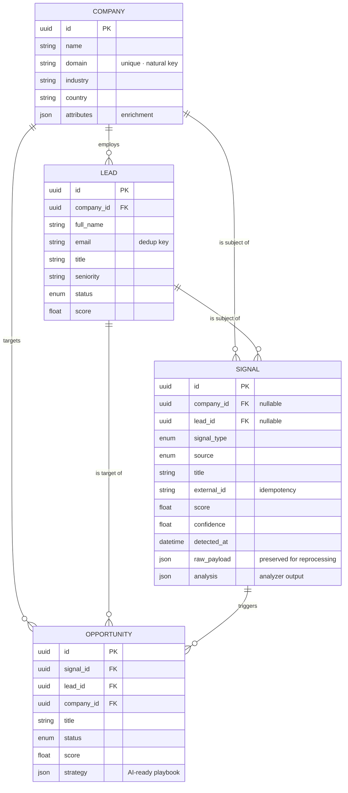

# 🐝 BEE — Sales Force Intelligence

> A living system that **detects** and **executes** sales opportunities from
> real-time market signals. Modular, efficient, and market-aware by design.

BEE watches the market for the moments that matter — a funding round, a key
hire, a new tool in the stack — scores them, and turns each qualified trigger
into an actionable, prioritized opportunity (lead + signal + strategy), ready for
an AI layer to generate the play.

---

## 1. Architecture — decoupled & scalable

A **monorepo** with independently deployable apps. This keeps the frontend and
backend loosely coupled (they communicate only over a versioned HTTP API) while
sharing a single source of truth for tooling, docs, and CI.

```
bee/
├── apps/
│   ├── api/                     FastAPI + SQLModel + PostgreSQL backend
│   │   ├── app/
│   │   │   ├── core/            config · database · security · logging
│   │   │   ├── models/          SQLModel entities (the DB schema)
│   │   │   ├── schemas/         Pydantic DTOs (external API contract)
│   │   │   ├── repositories/    Repository pattern (data access)
│   │   │   ├── services/
│   │   │   │   └── signal_engine/   ← Motor de Señales
│   │   │   │       ├── engine.py         orchestration
│   │   │   │       └── analyzers/        ← THE EXTENSION POINT (plugins)
│   │   │   └── api/v1/          thin HTTP routers
│   │   ├── alembic/            database migrations
│   │   ├── tests/              hermetic tests (SQLite, no Postgres needed)
│   │   ├── Dockerfile
│   │   └── requirements.txt
│   │
│   └── web/                     Next.js (App Router) + TS + Tailwind + shadcn/ui
│       └── src/
│           ├── app/            / (landing) · /dashboard (intelligence)
│           ├── components/     UI + shadcn primitives
│           └── lib/            API client · types · formatting
│
├── docker-compose.yml           Postgres + API for local dev
└── README.md
```

**Why this layout deploys cleanly**

- `apps/web` → Vercel (or any Node host). Points at the API via
  `NEXT_PUBLIC_API_URL`.
- `apps/api` → any container platform (Fly, Railway, Render, ECS…) using the
  provided `Dockerfile`. Scales horizontally and is ready for async workers.
- `docker-compose.yml` runs the whole stack locally with one command.

### Clean, layered dependencies

```
HTTP (api/) → Services (signal_engine/) → Repositories → Models → PostgreSQL
                     ↑
               Analyzers (plugins)
```

Each layer depends only on abstractions from the layer below (Dependency
Inversion), so any piece can be tested or replaced in isolation.

---

## 2. Database schema

Four core entities. **An Opportunity is the heart of BEE**: it connects a
`Lead` + a `Signal` + a `strategy`.



Design choices that make it future-proof:

- **UUID primary keys** — non-guessable, generatable across shards/integrations.
- **JSON columns** (`attributes`, `raw_payload`, `analysis`, `strategy`) — the
  schema stays stable while integrations and the AI layer evolve. Original
  payloads are never lost, so historical signals can be re-analyzed.
- **Nullable FKs on Signal** — ingestion is never blocked by incomplete entity
  data; resolution can be enriched asynchronously.
- **`external_id`** — idempotent ingestion / dedup for retrying webhooks.

---

## 3. The Signal Engine (Motor de Señales)

`POST /api/v1/signals/webhook`

An HMAC-authenticated webhook that:

1. verifies the sender's signature,
2. validates the JSON envelope,
3. resolves the company & lead (get-or-create),
4. runs **every applicable analyzer** and aggregates their verdicts,
5. persists the `Signal`,
6. materializes an `Opportunity` when an analyzer proposes a strategy.

### Extensible by design (the key requirement)

Adding a new kind of intelligence = writing one class and decorating it. **No
changes to the engine, endpoints, or database.**

```python
from app.services.signal_engine.analyzers.base import AnalysisResult, SignalAnalyzer
from app.services.signal_engine.analyzers.registry import register_analyzer

@register_analyzer
class LLMAnalyzer(SignalAnalyzer):
    name = "llm"
    priority = 200  # runs before the rule-based analyzers

    def supports(self, payload) -> bool:
        return True

    def analyze(self, payload) -> AnalysisResult:
        # call your model (settings.AI_API_KEY / settings.AI_MODEL),
        # then return a rich, generated strategy
        ...
```

This is exactly how the **AI layer** plugs in later — the architecture is ready
for it now.

---

## 4. Security

- **No secrets in code.** All configuration comes from the environment via typed
  `pydantic-settings`. `.env` is git-ignored; `.env.example` documents the
  contract.
- **Signed webhooks.** Inbound requests carry an HMAC-SHA256 signature
  (`X-BEE-Signature`) verified against `WEBHOOK_SIGNING_SECRET`. Enforcement is
  toggled on for production.
- **Least privilege.** The API container runs as a non-root user.

---

## 5. Quickstart

### Everything at once (recommended)

```bash
docker compose up --build        # Postgres + API
# → API:  http://localhost:8000/docs
```

```bash
cd apps/web
cp .env.example .env.local
pnpm install && pnpm dev         # → http://localhost:3000
```

### Backend only (with tests)

```bash
cd apps/api
cp .env.example .env
uv venv .venv && source .venv/bin/activate   # or python -m venv
uv pip install -r requirements-dev.txt
pytest                                        # 11 tests, hermetic
uvicorn app.main:app --reload
```

### Try the engine

```bash
curl -X POST http://localhost:8000/api/v1/signals/webhook \
  -H "content-type: application/json" \
  -d '{
    "title": "Acme raised a $20M Series B",
    "event": "funding.round.announced",
    "external_id": "provider:evt_123",
    "company": {"name": "Acme", "domain": "acme.com"},
    "lead": {"full_name": "Jane Doe", "email": "jane@acme.com", "title": "VP Sales"}
  }'
```

### Dry run — External Ingestion (LinkedIn webhook)

Simulates a signed LinkedIn webhook through the full async pipeline
(`IngestionWorker` → `ExternalAPIOrchestrator` → `EnrichmentContext`):

```bash
# In-process (SQLite, no server required):
python scripts/simulate_signal.py

# Against running API (docker compose):
python scripts/simulate_signal.py --mode http --base-url http://localhost:8000

# Validate failure logs (LinkedIn API down) — no secrets leaked:
python scripts/simulate_signal.py --failure
```

---

## 7. Production deployment checklist

BEE is **deployable** after the External Ingestion + Security layers. Before enabling
real webhook traffic, complete this checklist:

### Required (security)

| Variable | Action |
|----------|--------|
| `API_SECRET_KEY` | Generate with `python -c "import secrets; print(secrets.token_hex(32))"` — protects all REST endpoints |
| `WEBHOOK_SIGNATURE_REQUIRED` | Set to `true` in production |
| `WEBHOOK_SIGNING_SECRET` | Strong random secret — default `change-me-in-production` is **not** safe |
| `LINKEDIN_WEBHOOK_SECRET` | Per-provider HMAC secret for `/api/v1/webhooks/receive` |
| `G2_WEBHOOK_SECRET` / `GOOGLE_WEBHOOK_SECRET` | Set when those providers are active |
| `ENVIRONMENT` | Set to `production` (enables HSTS security headers) |

### Required (database)

```bash
# Run migrations (includes pgvector Sales DNA table):
cd apps/api && alembic upgrade head

# Enable pgvector extension (one-time, on managed Postgres):
CREATE EXTENSION IF NOT EXISTS vector;
```

Use `init_db()` only for local dev — production must use Alembic.

### Recommended (competitive advantage)

| Variable | Purpose |
|----------|---------|
| `VECTOR_STORE_BACKEND=pgvector` | Persistent Sales DNA memory |
| `AI_PROVIDER=openai` + `AI_API_KEY` | LLM strategy/artifact generation |
| `LINKEDIN_ACCESS_TOKEN` | Real LinkedIn profile enrichment (mock fallback without it) |
| `EXTERNAL_INGESTION_ENABLED=true` | Starts `IngestionWorker` on app boot |

### Gotchas (manual steps)

1. **`/api/v1/webhooks/receive` is exempt from API key auth** — it uses HMAC per provider instead. Do not remove this exemption; external systems cannot send `X-API-Key`.

2. **`IngestionWorker` is in-process (asyncio.Queue)** — it starts automatically on app boot when `EXTERNAL_INGESTION_ENABLED=true`. For multi-instance deployments, consider a Redis-backed queue (future) so enrichment tasks are not lost on restart.

3. **Docker Compose Postgres does not include pgvector by default** — use `pgvector/pgvector:pg16` image or run `CREATE EXTENSION vector` manually before `VECTOR_STORE_BACKEND=pgvector`.

4. **LinkedIn API requires OAuth app approval** — without `LINKEDIN_ACCESS_TOKEN`, BEE uses deterministic mock profiles (safe for staging, not for production enrichment).

5. **Frontend must send `X-API-Key`** on all API calls when `API_SECRET_KEY` is set — configure `NEXT_PUBLIC_BEE_API_KEY` in the Next.js app (see `apps/web/.env.example`).

6. **Run the dry run after deploy** to verify the pipeline:
   ```bash
   python scripts/simulate_signal.py --mode http --base-url https://your-api.example.com
   ```

### Health checks

| Endpoint | Purpose |
|----------|---------|
| `GET /api/v1/health` | Liveness (no auth) |
| `GET /api/v1/ready` | DB connectivity |
| `GET /api/v1/status` | Deep subsystem check (DB, vector store, DLQ, security) |
| `GET /api/v1/webhooks/status` | Ingestion worker queue depth + provider config |

---

## 8. Tech stack

| Layer     | Technology                                        |
| --------- | ------------------------------------------------- |
| Frontend  | Next.js (App Router), TypeScript, Tailwind CSS, shadcn/ui |
| Backend   | Python, FastAPI, SQLModel, Pydantic               |
| Database  | PostgreSQL (Alembic migrations)                   |
| Infra     | Docker / docker-compose                           |

Built on **SOLID** principles, ready to grow into a full market-intelligence
platform.
